## JOBSHEET 5

## PEMILIHAN 1

### Tujuan

Mahasiswa mampu menyelesaikan permasalahan/studi kasus menggunakan sintaks pemilihan 1 dan mengimplemantasikannya dalam bahasa pemrogaman java.

### Alat dan Bahan
+ PC/laptop
+ Browser(chrome, firefox, safari)
+ Koneksi internet

### Praktikum

#### Percobaan 1 : Penggunaan if

#### Waktu percobaan : 40 menit

1. Perhatikan flowchart dibawah ini!

    <p align="left">
    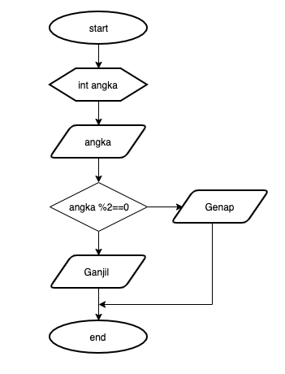
    </p>

> Flowchart diatas digunakan untuk menentukan bilangan ganjil/genap, selanjutnya kita akan membuat programnya berdasarkan
> flowchart di atas!

2. Tambahkan library Scanner, deklarasi Scanner, dan buat variabel bil untuk menampung data yang diinput melalui keyboard

    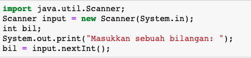


```Java
// Ketik kode program di atas di bawah sini
import java.util.Scanner; // Untuk import library Scanner
Scanner input = new Scanner(System.in); // Deklarasi fungsi input
int bil; // Deklarasi variabel bilangan
System.out.print("Masukkan sebuah bilangan:  "); // Menampilkan sebuah label untuk pengisian bilangan
bil = input.nextInt(); // Assignment variabel bilangan mengikuti isi dari input user
```

    Masukkan sebuah bilangan:  25


3. Buatlah struktur kondisi untuk mengecek apakah bilangan tersebut merupakan bilangan genap atau ganjil

    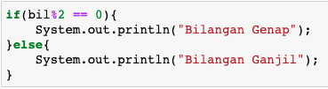


```Java
// Ketik kode program di atas di bawah sini
if(bil % 2 == 0) { // Sintaks pemilihan bilangan
    System.out.println("Bilangan Genap"); // Jika hasil true maka akan keluar output bilangan genap
} else {
    System.out.println("Bilangan Ganjil"); // Jika hasil true maka akan keluar output bilangan ganjil
}
```

    Bilangan Ganjil


##### Pertanyaan
1. Modifikasi program diatas dibagian struktur pemilihannya sehingga menjadi sebagai berikut:

    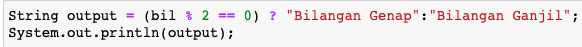


```Java
// Ketik kode program di atas di bawah sini
String output = (bil % 2 == 0) ? "Bilangan Genap" : "Bilangan Ganjil"; // Pemilihan dengan metode ternary operator
System.out.println(output); // output hasil dari pemilihan variabel output
```

    Bilangan Ganjil


2. Jalankan dan amatilah hasilnya!
3. Jelaskan mengapa output program yang dimodifikasi sama dengan output program sebelum dimodifikasi!
 ### Jawaban
    3. Karena kedua output tersebut sama fungsinya, namun berbeda sintaksnya
#### Percobaan 2 : Penggunaan if else

#### Waktu percobaan : 40 menit

+ Buatlah sebuah variabel nilai untuk menyimpan inputan dari keyboard

    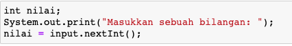


```Java
// Ketik kode program di atas di bawah sini
int nilai; // deklarasi variabel nilai
System.out.print("Masukkan sebuah bilangan: "); // Output sebagai label input 
nilai = input.nextInt(); // Assignment nilai dengan input keyboard
```

    Masukkan sebuah bilangan: 20


+ Tambahkan sebuah kondisi untuk mengecek input pada variabel nilai

    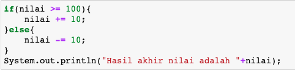


```Java
// Ketik kode program di atas di bawah sini
if(nilai >= 100) { // Pemilihan variabel nilai jika lebih dari sama dengan 100
    nilai += 10; // Menambahkan 10 nilai pada variabel nilai jika kondisi benar
} else {
    nilai -= 10; // Mengurangi 10 nilai pada variabel nilai jika kondisi salah
}
System.out.println("Hasil akhir nilai adalah " + nilai); // Output hasil akhir dan variabel nilai
```

    Hasil akhir nilai adalah 10


+ Jalankan program. Amati apa yang terjadi!

##### Pertanyaan
1. Jelaskan fungsi kode program berikut:
    
    ```
    nilai+=10;
    nilai-=10;
    ```
    
    - nilai +=10 (menambahkan nilai 10 pada variabel nilai)
    - nilai -=10 (mengurangi nilai 10 pada variabel nilai)
    
2. Modifikasilah program diatas dimana inputannya yang awalnya hanya satu kemudian diganti 2 inputan (misal : nilai1 dan nilai2), lakukan perhitungan rata-rata kedua nilai tersebut jika nilainya lebih dari sama dengan 100 maka dikurangi 5, sedangkan jika nilai rata-rata tersebut kurang dari 100 maka akan langsung dicetak!

### Jawaban
1. - nilai +=10 (menambahkan nilai 10 pada variabel nilai)
   - nilai -=10 (mengurangi nilai 10 pada variabel nilai)    
    
   Kedua **ekspresi** tersebut dijalankan sebelum program berakhir
2. 

```Java
int nilai, nilai2; // Deklarasi variabel nilai dan nilai2
double rataRata; // Deklarasi variabel rataRata

System.out.print("Masukkan bilangan 1 : "); // Output sebagai label input keyboard
nilai = input.nextInt(); // Assignment variabel nilai berdasarkan input keyboard
System.out.print("Masukkan bilangan 2: "); // Output sebagai label input keyboard
nilai2 = input.nextInt(); // Assignment variabel nilai berdasarkan input keyboard

rataRata = (double) (nilai + nilai2) / 2; // Casting penjumlahan nilai1 dengan nilai2 lalu dibagi 2

if(rataRata >= 100) { // Pemilihan dari variabel rataRata apabila lebih dari sama dengan 100 atau tidak
    rataRata -= 5; // Jika kondisi benar maka value rataRata akan dikurangi 5
} else {
    System.out.println("Hasil dari rata-rata kedua nilai tersebut adalah " + rataRata); // Output dari hasil rataRata
}
```


#### Percobaan 3 : Penggunaan if else-if else

#### Waktu percobaan : 40 menit

+ Tambahakan library `Scanner`
+ Buatlah deklarasi `Scanner`
+ Buat variabel umur bertipe `int`

    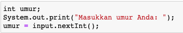


```Java
// Ketik kode program di atas di bawah sini
import java.util.Scanner; // Import library java
int umur; // Deklarasi variabel umur
Scanner input = new Scanner(System.in); // Assignment fungsi Scanner
umur = input.nextInt(); // Assignment variabel umur dengan input keyboard
```

+ Kode untuk melakukan pengecekan variabel `umur`

    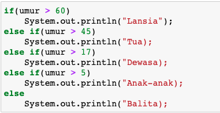


```Java
// Ketik kode program di atas di bawah sini
if(umur > 60) // Pemilihan variabel umur apabila lebih dari 60
System.out.println("Lansia"); // Output sebagai label input keyboard
else if(umur > 45) // apabila variable umur lebih dari 45 maka perintah dibawah akan dieksekusi
System.out.println("Tua"); // Output sebagai label input keyboard
else if(umur > 17) // apabila variable umur lebih dari 17 maka perintah dibawah akan dieksekusi 
System.out.println("Dewasa"); // Output sebagai label input keyboard
else if(umur > 5) // apabila variable umur lebih dari 5 maka perintah dibawah akan dieksekusi
System.out.println("Anak-anak"); // Output sebagai label input keyboard
else // Jika tidak ada kondisi yang benar, maka kode dibawah akan dijalankan
System.out.println("Balita"); // Output sebagai label input keyboard
```

+ Jalankan program dan amati apa yang terjadi!

##### Percobaan 4 : Penggunaan switch-case

#### Waktu percobaan : 40 menit

1. Deklarasikan Scanner
1. Buatlah variabel-variabel berikut

    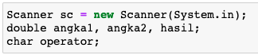


```Java
// Ketik kode program di atas di bawah sini
Scanner sc = new Scanner(System.in); // Deklarasi fungsi scanner 
double angka1, angka2, hasil; // deklarasi variabel angka1, angka2, hasil
char operator; // deklarasi variabel operator
```

3. Kode program untuk meminta inputan dari keyboard

    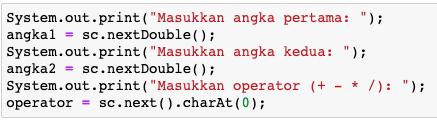


```Java
// Ketik kode program di atas di bawah sini
System.out.print("Masukkan angka pertama: "); // Output sebagai label input keyboard
angka1 = sc.nextDouble(); // Assignment variabel angka1 berdasarkan input keyboard
System.out.print("Masukkan angka kedua: "); // Output sebagai label input keyboard
angka2 = sc.nextDouble(); // Assignment variabel angka2 berdasarkan input keyboard
System.out.print("Masukkan operator (+ - * /): "); // Output sebagai label input keyboard
operator = sc.next().charAt(0); // Mencari karakter pertama pada `input` lalu menjadi isi dari variabel `operator`
```

4. Kode di bawah ini untuk melakukan pengecekan operator yang digunakan sebelum dilakukan operasi aritmatika

    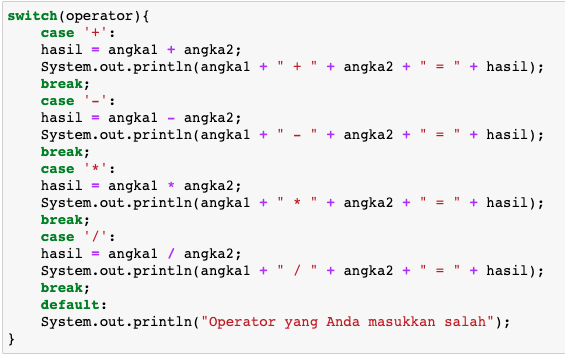


```Java
// Ketik kode program di atas di bawah sini
switch(operator){ // Sintaks awal switch
    case '+': // Pemilihan operator jika dimulai dengan +
        hasil = angka1 + angka2; // Assignment variabel hasil dengan penjumlahan angka1 dengan angka2
        System.out.println(angka1 + " + " + angka2 + " = " + hasil); // Output variabel angka,angka2 beserta hasilnya
    break; // Perintah untuk menghentikan program jika salah satu kondisi diatas benar
    case '-': // Pemilihan operator jika dimulai dengan -
        hasil = angka1 - angka2; // Assignment variabel hasil dengan penjumlahan angka1 dengan angka2
        System.out.println(angka1 + " — " + angka2 + " = " + hasil); // Output variabel angka,angka2 beserta hasilnya
    break; // Perintah untuk menghentikan program jika salah satu kondisi diatas benar
    case '*': // Pemilihan operator jika dimulai dengan *
        hasil = angka1 * angka2; // Assignment variabel hasil dengan penjumlahan angka1 dengan angka2
        System.out.println(angka1 + " * " + angka2 + " = " + hasil); // Output variabel angka,angka2 beserta hasilnya
    break; // Perintah untuk menghentikan program jika salah satu kondisi diatas benar
    case '/': // Pemilihan operator jika dimulai dengan /
        hasil = angka1 / angka2; // Assignment variabel hasil dengan penjumlahan angka1 dengan angka2
        System.out.println(angka1 + " / " + angka2 + " = " + hasil); // Output variabel angka,angka2 beserta hasilnya
    break; // Perintah untuk menghentikan program jika salah satu kondisi diatas benar
    default: // Fungsi yang sama dari kondisi else
        System.out.println("Operator yang Anda masukkan salah"); // Output dari perintah default(else)
}
```

5. Jalankan program. Amati apa yang terjadi!

##### Pertanyaan
1. Jelaskan fungsi dari break dan default pada percobaan 4 diatas!
2. Jelaskan fungsi perintah kode program dibawah ini pada percobaan 4!

    ```
    operator = sc.next().chartAt(0);
    ```
### Jawaban
   
    1. - break : Sebagai pemberhentian kode ketika satu kondisi bernilai `true`
       - default : Sebagai pengganti `else` pada kondisi `if else`
    2. Mencari karakter pertama pada `input` lalu menjadi isi dari variabel `operator`
### Tugas

#### Waktu pengerjaan Tugas: 140 menit

1. Buatlah program untuk menginputkan dua buah bilangan bulat, kemudian mencetak salah satu bilangan yang nilainya terbesar.
2. Perhatikan flowchart berikut ini:

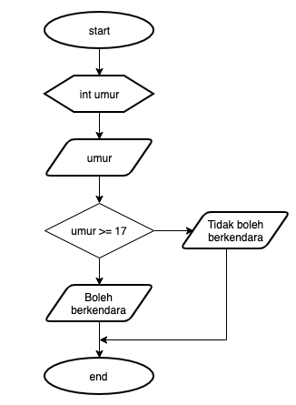

> Buatlah program sesuai dengan flowchart diatas!
```java
import java.util.Scanner; // Sintaks import library scanner
Scanner in = new Scanner(System.in); // Assignment fungsi scanner
int umur; // Deklarasi variabel umur

System.out.println("Masukkan umur anda: "); // Output sebagai label input keyboard
umur = in.nextInt(); // Assignment variable umur berdasarkan input keyboard

if(umur >= 17) { // Pemilihan variabel umur apabila lebih dari sama dengan 17
    System.out.println("Boleh berkendara"); // Output jika Pemilihan diatas menhasilkan benar
} else { // Apabila Pemilihan diatas salah maka output dibawah akan dieksekusi
    System.out.println("Tidak boleh berkendara"); // Output jika Pemilihan diatas salah
}
```
3. Pada akhir semester seorang dosen menghitung nilai akhir dari mahasiswa yang terdiri dari nilai uas, uts, kuis, dan tugas. Nilai akhir didapatkan dari 40% nilai uas, 30% nilai uts, 10% nilai kuis, dan 20% nilai tugas. Jika nilai akhir dari mahasiswa dibawah 65 maka mahasiswa tersebut akan mendapatkan remidi. Buatlah program untuk membantu mengetahui mahasiswa yang mendapatkan remidi berdasarkan nilai akhir yang didapatkannya!
```java
import java.util.Scanner; // Sintaks import library scanner
      
Scanner in = new Scanner(System.in); // Assignment fungsi scanner

double uas, uts, kuis, tugas, nilaiAkhir; // Deklarasi variabel uas, uts, kuis, tugas, nilaiAkhir
System.out.println("---------Masukkan Nilai---------");
System.out.print("UAS : "); // Output sebagai label input keyboard
uas = in.nextDouble(); // Assignment variabel uas dengan input keyboard
System.out.print("UTS : "); // Output sebagai label input keyboard
uts = in.nextDouble(); // Assignment variabel uts dengan input keyboard
System.out.print("Kuis : "); // Output sebagai label input keyboard
kuis = in.nextDouble(); // Assignment variabel kuis dengan input keyboard
System.out.print("Tugas : "); // Output sebagai label input keyboard
tugas = in.nextDouble(); // Assignment variabel tugas dengan input keyboard

System.out.print("UAS: " + uas); // Output nilai uas
System.out.print("UTS: " + uts); // Output nilai uts
System.out.print("Kuis: " + kuis); // Output nilai kuis
System.out.print("Tugas: " + tugas); // Output nilai tugas

uas = uas * ((double) 40 / 100); // Assignment variabel uas dengan perkalian uas dengan masing masing persentasenya
uts = uts * ((double) 30 / 100); // Assignment variabel uts dengan perkalian uts dengan masing masing persentasenya
kuis = kuis * ((double) 10 / 100); // Assignment variabel kuis dengan perkalian kuis dengan masing masing persentasenya
tugas = tugas * ((double) 20 / 100); // Assignment variabel tugas dengan perkalian tugas dengan masing masing persentasenya

System.out.print("\nUAS: " + uas); // Output nilai uas
System.out.print("UTS: " + uts); // Output nilai uts
System.out.print("Kuis: " + kuis); // Output nilai kuis
System.out.print("Tugas: " + tugas); // Output nilai tugas

nilaiAkhir = uas + uts + kuis + tugas; // Assignment variabel nilaiAkhir dengan penjumlahan uas, uts, kuis dan tugas

System.out.print("\nNilai Akhir: " + nilaiAkhir); // Output nilai akhir
if(nilaiAkhir <= 65) { // Perkondisian nilaiAkhir jika kurang dari sama dengan 65 atau tidak
    System.out.println("\nRemidi"); // Output remidi jika kondisi diatas benar
} else { // Apabila Pemilihan diatas salah maka output dibawah akan dieksekusi
    System.out.println("\nSelamat Anda Lulus"); // Output remidi jika kondisi diatas salah
}
```

4. Sebuah toko memberikan diskon kepada pelanggannya dengan ketentuan sebagai berikut:

| Total Belanja     | Potongan |
|-------------------|----------|
| >Rp. 200.000,00   | 2%       |
| >Rp. 500.000,00   | 5%       |
| >Rp. 1.000.000,00 | 10%      |

> Total belanja diperoleh dari pembelian tiga barang yaitu barang A, barang B, dan barang C. Ketika menginputkan harga barang juga menginputkan jumlah barang yang dibeli.

Contoh outputnya
```
Masukkan harga barang A   :100000
Masukkan jumlah barang A  :10
Masukkan harga barang B   :250000
Masukkan jumlah barang B  :5
Masukkan harga barang C   :150000
Masukkan jumlah barang C  :1
---------------------------------------------
                Struk total
---------------------------------------------
Nama Barang 	| 	Harga 	| 	Jumlah 	| 	Total
Barang A            100000         10        1000000   
Barang B            250000         5         1250000   
Barang C            150000         1         150000    
Total       :2400000
Diskon      :240000.0
Total Bayar :2160000.0
```
```java
import java.util.Scanner; // Sintaks import library scanner
Scanner in = new Scanner(System.in); // Assignment fungsi Scanner

int barangA,barangB,barangC; // Deklarasi variabel barangA,barangB,barangC
double hargaA, hargaB, hargaC; // Deklarasi variabel hargaA, hargaB, hargaC

double total, diskon,totalBayar; // Deklarasi variabel total, diskon,totalBayar
System.out.print("Masukkan harga barang A : "); // Output sebagai label input keyboard
hargaA = in.nextDouble(); // Assignment Variabel hargaA berdasarkan input keyboard
System.out.print("Masukkan jumlah barang A : "); // Output sebagai label input keyboard
barangA = in.nextInt(); // Assignment Variabel barangA berdasarkan input keyboard
System.out.print("Masukkan harga barang B : "); // Output sebagai label input keyboard
hargaB = in.nextDouble(); // Assignment Variabel hargaB berdasarkan input keyboard
System.out.print("Masukkan jumlah barang B : "); // Output sebagai label input keyboard
barangB = in.nextInt(); // Assignment Variabel barangB berdasarkan input keyboard
System.out.print("Masukkan harga barang C : "); // Output sebagai label input keyboard
hargaC = in.nextDouble(); // Assignment Variabel hargaC berdasarkan input keyboard
System.out.print("Masukkan jumlah barang C : "); // Output sebagai label input keyboard
barangC = in.nextInt(); // Assignment Variabel barangC berdasarkan input keyboard

total = (hargaA*barangA) + (hargaB*barangB) + (hargaC*barangC); // Assignment variabel total dengan perkalian dari masing masing barang
if(total >= 1000000) { // Jika total lebih dari sama dengan 1000000 maka perintah dibawah akan dieksekusi
  diskon = (double) 10/100; // Assignment Variabel diskon dengan operasi aritmatika 
} else if(total >= 500000) { // Pemilihan dari total jika kondisi tersebut benar, maka perintah dibawah akan dieksekusi
  diskon = (double) 5/100;  // Assignment Variabel diskon dengan operasi aritmatika 
} else if(total >= 200000) { // Pemilihan dari total jika kondisi tersebut benar, maka perintah dibawah akan dieksekusi
  diskon = (double) 2/100;  // Assignment Variabel diskon dengan operasi aritmatika 
} else { // Pemilihan jika kondisi tidak ada yang benar, maka perintah dibawah akan dieksekusi
    diskon = 0; // Assignment diskon nilai ke 0 jika pemilihan tidak ada yang benar
}
totalBayar = total - total * diskon; // Assignment dari variabel totalBayar dengan totalBayar dikurangi hasil dari diskon
System.out.println("Diskon Saat ini: " + diskon); // Output diskon saat ini
System.out.println("\n----------------------------------------------------------------------");
System.out.println("                             Struk Total                              ");
System.out.println("----------------------------------------------------------------------");
System.out.println("Nama Barang\t|\tHarga\t|\tJumlah\t|\tTotal"); // Membuat header tabel
System.out.println(String.format("Barang A\t\t%s\t%s\t\t%s",hargaA, barangA, hargaA*barangA)); // Output masing masing harga
System.out.println(String.format("Barang B\t\t%s\t%s\t\t%s",hargaB, barangB, hargaB*barangB)); // Output masing masing harga
System.out.println(String.format("Barang A\t\t%s\t%s\t\t%s",hargaC, barangC, hargaC*barangC)); // Output masing masing harga
System.out.println("Total\t:" + total); // Output total pembelanjaan
System.out.println("Diskon\t:" + (total * diskon)); // Output diskon
System.out.println("Total\t:" + totalBayar); // Output dari variabel totalBayar

in.close(); // Close input scanner, agar tidak terjadi leak memory
```