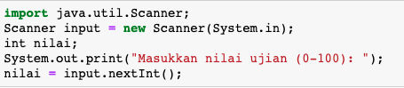
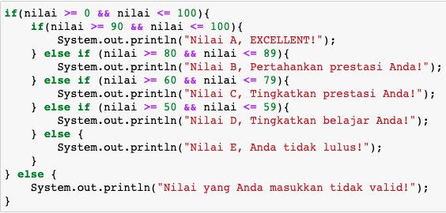
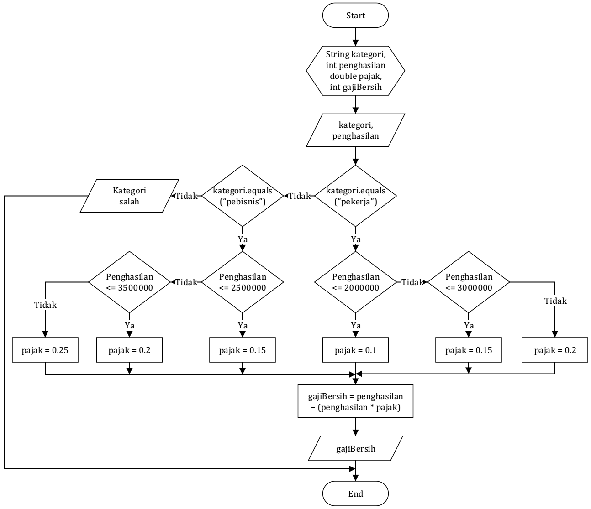
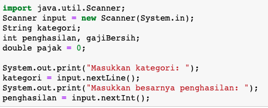
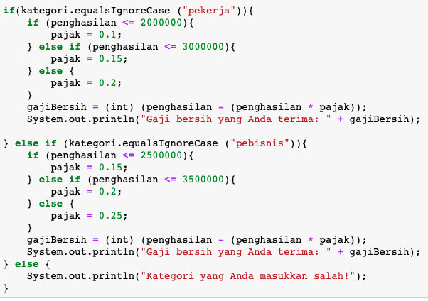
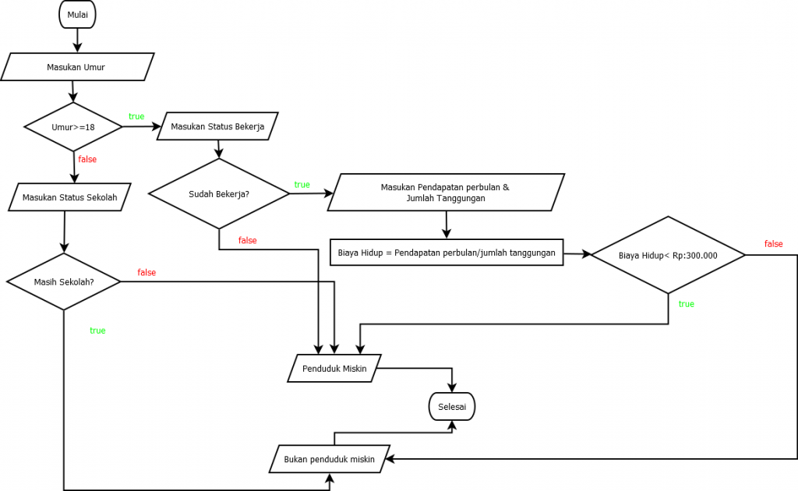

## JOBSHEET 6

## PEMILIHAN 2

### Tujuan

Mahasiswa memahami tentang operator logika; Mahasiswa mampu menyelesaikan permasalahan dengan menggunakan sintaks pemilihan bersarang; Mahasiswa mampu membuat sebuah program Java yang memanfaatkan sintaks pemilihan bersarang


### Alat dan Bahan
+ PC/laptop
+ Browser(chrome, firefox, safari)
+ Koneksi internet

### Praktikum

#### Percobaan 1

#### Waktu percobaan : 40 menit

1. Tambahkan library Scanner, deklarasi Scanner

2. Buatlah variabel nilai yang memiliki tipe data int untuk menampung data yang diinput melalui keyboard

    


```Java
import java.util.Scanner;
Scanner input = new Scanner(System.in);
int nilai;
System.out.print("Masukkan nilai ujian (0-100): ");
nilai = input.nextInt();

```

    Masukkan nilai ujian (0-100): 200


3. Buatlah struktur pengecekan kondisi bersarang. Pengecekan pertama digunakan untuk memastikan bahwa nilai yang dimasukkan berada pada rentang 0 – 100. Jika nilai berada pada rentang 0 – 100, maka akan dilakukan pengecekan status kelulusan mahasiswa, yaitu jika nilai di antara 90 – 100 maka nilainya A, jika nilai di antara 80 – 89 maka nilainya B, jika nilai di antara 60 – 79 maka nilainya C, jika nilai di antara 50 – 59 maka nilainya D, dan jika nilai di antara 0 – 49 maka nilainya E. Sedangkan jika nilai berada di luar rentang 0 – 100, maka ditampilkan informasi bahwa nilai yang dimasukkan tidak valid.

    


```Java
    if(nilai >= 90 && nilai <= 100){
        System.out.println("Nilai A, Hebat mamamu pasti bangga");
    }else if (nilai >= 80 && nilai <= 89 ){
        System.out.println("Nilai B, Pertahankan prestasi Anda!");
    }else if (nilai >= 60 && nilai <= 79){
        System.out.println("Nilai C, Pertahankan prestasi Anda!");
    }else if (nilai >= 50 && nilai <= 59){
        System.out.println("Nilai D, Belajar lagi agar mamamu tidak marah!");
    }else if(nilai >=0 && nilai <=50) {
        System.out.println("Nilai E,Mamamu tidak bangga  ");
    }else if(nilai <=0){
        System.out.println("Nilai yang anda masukkan kurang dari 0");
    }else if(nilai >=100){
        System.out.println("Nilai yang anda masukkan lebih dari 100");
    } else {
    System.out.println("Nilai yang Anda masukkan tidak valid!");
}
    

```

    Nilai yang anda masukkan lebih dari 100


> Penjelasan kode program percobaan 1


kode program diatas digunakan untuk mengetahui nilai huruf angka berdasarkan nilai angka nya,didalam script terdapat ekspresi logika && yang berarti 2 kondisi harus true jika salah satu tidak true akan lanjut ke kondisi selanjutnya

##### Pertanyaan

1. Modifikasi kode program pada Percobaan 1 sehingga jika nilai yang dimasukkan kurang dari 0 akan ditampilkan output “Nilai yang Anda masukkan kurang dari 0” dan jika nilai yang dimasukkan lebih dari 100 akan ditampilkan output “Nilai yang Anda masukkan lebih dari 100”!

2. Jelaskan fungsi sintaks if (nilai >= 0 && nilai <= 100)!

3. Ubah operator && menjadi || pada sintaks if (nilai >= 0 && nilai <= 100). Jalankan program dengan memasukkan nilai = 105. Amati apa yang terjadi! Mengapa hasilnya demikian?

#### Jawaban
1. sudah

2. untuk memastikan rentang menginputkan angka nya

3. jika diinputkan 200 maka akan tampil Nilai E,Mamamu tidak bangga karena salah satu dari kondisi nya benar maka code yang else di baris terakhir tidak berguna


#### Percobaan 2

#### Waktu percobaan : 40 menit

1. Perhatikan flowchart dibawah ini!



> Flowchart tersebut digunakan untuk menghitung gaji bersih seseorang setelah dipotong pajak sesuai dengan kategorinya (pekerja dan pebisnis) dan besarnya penghasilan. 

2. Tambahkan library Scanner dan deklarasi Scanner

3. Deklarasikan variabel kategori, penghasilan, gajiBersih, dan pajak

    


```Java
import java.util.Scanner;
Scanner input = new Scanner(System.in);
String kategori;
int penghasilan, gajiBersih;
double pajak = 0;
System.out.print("Masukkan kategori: ");
kategori = input.nextLine();
System.out.print("Masukkan besarnya penghasilan: ");
penghasilan = input.nextInt();
```

    Masukkan kategori: pekerja
    Masukkan besarnya penghasilan: 3000000


4. Buatlah struktur pengecekan kondisi bersarang. Pengecekan pertama digunakan untuk mengecek kategori (pekerja atau pebisnis). Selanjutnya dilakukan pengecekan kedua untuk menentukan besarnya pajak berdasarkan penghasilan yang telah dimasukkan.Kemudian tambahkan kode program untuk menghitung gaji bersih yang diterima setelah dipotong pajak!

    


```Java
if(kategori.equalsIgnoreCase ("pekerja")){
    if(penghasilan <= 2000000){
        pajak = 0.1;
    }else if (penghasilan <= 3000000){
        pajak = 0.15;
    } else {
        pajak = 0.2;
    }
    gajiBersih = (int) (penghasilan - (penghasilan * pajak));
    System.out.println("Gaji bersih yang Anda terima: " + gajiBersih); 
} else if(kategori.equalsIgnoreCase ("pebisnis")){
    if(penghasilan <= 2500000){
        pajak = 0.15;
    }else if (penghasilan <= 3500000){
        pajak = 0.2;
    } else {
        pajak = 0.25;
    }
    gajiBersih = (int) (penghasilan - (penghasilan * pajak));
    System.out.println("Gaji bersih yang Anda terima: " + gajiBersih); 
} else {
    System.out.println("Kategori yang anda masukkan salah!");
}
```

    Gaji bersih yang Anda terima: 2550000


5. Jalankan program di atas. Amati apa yang terjadi!

> Penjelasan kode program percobaan 2
saya bingung mau menjelaskanya soalnya saya sudah cukup paham,mungkin di gajibersih = (int) itu sama saja dengan script int gajiBersih

##### Pertanyaan

1. Jalankan program dengan memasukkan kategori = pekerja dan penghasilan = 2048485. Amati apa yang terjadi! Mengapa angka di belakang koma tidak ditampilkan?

2. Jelaskan fungsi dari (int) pada sintaks:
```
gajiBersih = (int) (penghasilan - (penghasilan * pajak));
```

3.	Jalankan program dengan memasukkan kategori = pebisnis dan penghasilan = 2000000. Amati apa yang terjadi! Apa kegunaan dari equalsIgnoreCase?

4.	Ubah equalsIgnoreCase menjadi equals, kemudian jalankan program dengan memasukkan kategori = pebisnis dan penghasilan = 2000000. Amati apa yang terjadi! Mengapa hasilnya demikian? Apa kegunaan dari equals?

#### Jawaban
1. karena pakai integer 
2. untuk mengcasting karena angka yang ditampilkan sangat besar 
3. untuk memilih ke arah mana tujuan kita mau menginputkan
4. kalo memakai equals saja maka nilai yang harus diinputkan harus memakai huruf besar di awal nya jika equalsIgnoreCase tidak perlu pakai huruf besar bisa pakai huruf besar juga its okay

### Tugas

#### Waktu pengerjaan Tugas: 140 menit

1. Buatlah program kalkulator sederhana menggunakan bahasa pemrograman Java. User akan menginputkan dua buah bilangan riil dan satu buah operator aritmatika (+, -, *, atau /), kemudian program akan mengoperasikan dua bilangan tersebut dengan operator yang sesuai. Petunjuk: gunakan pernyataan switch-case.
Contoh tampilan program:

```
Masukkan bilangan pertama: 2.5
Masukkan operator (+, -, *, /): *
Masukkan bilangan kedua: 4
2.5 * 4.0 = 10.0

```


```Java
import java.util.Scanner;
Scanner input = new Scanner(System.in);
int bilangan, bilangan2, hasil;
char operator;

System.out.print("Inputkan Bilangan 1 :");
bilangan = input.nextInt();
System.out.print("Inputkan Operator (+, -,*, /) :");
operator = input.next().charAt(0);
System.out.print("Inputkan Bilangan 2 :");
bilangan2 = input.nextInt();

switch(operator) {
  case '+':
     hasil = bilangan + bilangan2;
    break;
  case '-':
     hasil = bilangan - bilangan2;
    break;
  case '*':
     hasil = bilangan * bilangan2;
    break;
  case '/':
     hasil = bilangan / bilangan2;
    break;
  default:
    System.out.print("input operator kliru");
}

if(operator == '+'|| operator == '-' || operator == '*' || operator == '/') {
    System.out.print("Hasil: " + hasil);
}
```

    Inputkan Bilangan 1 :30
    Inputkan Operator (+, -,*, /) :+
    Inputkan Bilangan 2 :20
    Hasil: 50

2. Dengan menggunakan tiga nilai yang mewakili panjang tiga sisi sebuah segitiga, tentukan apakah segitiga tersebut sama sisi (ketiga sisinya bernilai sama), sama kaki (kedua sisinya bernilai sama), atau sembarang (tidak ada sisi yang bernilai sama)! 


```Java
import java.util.Scanner;
Scanner input = new Scanner(System.in);
int sisi1,sisi2,sisi3;
System.out.println("Masukkan sisi 1:...cm ");
sisi1 = input.nextInt();
System.out.println("Masukkan sisi 2:...cm ");
sisi2 = input.nextInt();
System.out.println("Masukkan sisi 3:...cm");
sisi3 = input.nextInt();

if(sisi1 == sisi2 && sisi1 == sisi3){
    System.out.println("Segitiga sama sisi");
} else if(sisi1 == sisi2 ){
    System.out.println("Segitiga sama kaki");
} else{
    System.out.println("Segitiga sembarang");
}
```

    Masukkan sisi 1:...cm 
    3
    Masukkan sisi 2:...cm 
    2
    Masukkan sisi 3:...cm
    4
    Segitiga sembarang


3.Warung Padang Gembira meminta Anda membuat sebuah program untuk menerima pesanan dari internet. Program yang Anda buat meminta user untuk memasukkan nama makanan dan harga. Setelah itu, user ditawarkan untuk menggunakan pengiriman ekspres. Jika pengguna menolak, maka jenis pengiriman yang digunakan adalah pengiriman reguler. Biaya pengiriman reguler untuk harga makanan kurang dari Rp 100.000 adalah Rp 20.000, sedangkan untuk harga makanan sama dengan atau lebih dari Rp 100.000 biaya pengirimannya adalah Rp 30.000. Untuk jenis pengiriman ekspres, tambahkan biaya tambahan sebesar Rp 25.000 dari standar biaya pengiriman reguler. Tampilkan struk yang berisi nama makanan yang dibeli + harga, biaya pengiriman, dan total yang harus dibayar!

Contoh hasil output program:

```
Masukkan nama makanan: Tuna salad
Masukkan harga makanan: Rp 115000
Apakah Anda ingin pengiriman ekspres (0 = tidak, 1 = ya)? 0

STRUK PEMBELIAN
Tuna salad        Rp 115000
Biaya pengiriman  Rp 30000
TOTAL             Rp 145000

```

```
Masukkan nama makanan: Beef bulgogi
Masukkan harga makanan: Rp 78000
Apakah Anda ingin pengiriman ekspres (0 = tidak, 1 = ya)? 1

STRUK PEMBELIAN
Beef bulgogi      Rp 115000
Biaya pengiriman  Rp 45000
TOTAL             Rp 123000


```


```Java
import java.util.Scanner;
Scanner input = new Scanner(System.in);
int harga,total,ekspres;
String makanan;

System.out.println("Masukkan nama makanan: ");
makanan = input.nextLine();
System.out.print("Masukkan harga makanan: Rp. ");
harga = input.nextInt();
System.out.println("Apakah Anda ingin pengiriman ekspres? tekan 1 untuk ya,tekan 0 untuk tidak ");
ekspres = input.nextInt();

if(ekspres==1){
    if(harga >= 100000){
        System.out.println("STRUK PEMBELIAN");
        System.out.println(String.format("%s Rp %s", makanan,harga));
        System.out.println("Biaya Pengiriman: Rp.55.000 " );
        System.out.println("TOTAL "+ (harga  + 55000));
      }else if (harga <=100000){
        System.out.println("STRUK PEMBELIAN");
        System.out.println(String.format("%s Rp %s",makanan, harga));
        System.out.println("Biaya Pengiriman: Rp.45.000 " );
        System.out.println("TOTAL "+(harga + 45000));
    }
}
if(ekspres==0){
   if(harga >= 100000){
        System.out.println("STRUK PEMBELIAN");
        System.out.println(String.format("%s Rp %s", makanan,harga));
        System.out.println("Biaya Pengiriman: Rp.30.000 " );
        System.out.println("TOTAL "+ (harga  + 30000));
      }else if (harga <=100000){
        System.out.println("STRUK PEMBELIAN");
        System.out.println(String.format("%s Rp %s",makanan, harga));
        System.out.println("Biaya Pengiriman: Rp.20.000 " );
        System.out.println("TOTAL "+(harga + 20000));
    }
}
    
```

    Masukkan nama makanan: 
    Bulgog ra enak
    Masukkan harga makanan: Rp. 223000
    Apakah Anda ingin pengiriman ekspres? tekan 1 untuk ya,tekan 2 untuk tidak 
    1
    STRUK PEMBELIAN
    Bulgog ra enak Rp 223000
    Biaya Pengiriman: Rp.55.000 
    TOTAL 278000


# 4. Perhatikan flowchart berikut ini!



> Buatlah program sesuai dengan flowchart diatas!


```Java
import java.util.Scanner;
Scanner input = new Scanner(System.in);
int umur;
System.out.println("Masukkan Umur Ente: ");
umur =input.nextInt();

if(umur >=18){
     Scanner input = new Scanner(System.in); //saya menambahkan scanner baru karena setelah input int tidak bisa input string jadi saya tambahkan
     String kerja;
     System.out.println("Sudah Bekerja? ");
     kerja = input.nextLine();
     if(kerja.equalsIgnoreCase("bekerja")){
     int pendapatan,tanggungan;
     double biayaUrip;
     System.out.println("Masukkan Pendapatan Bulanan: ");
     pendapatan = input.nextInt();
     System.out.println("Masukkan Jumlah Tanggungan ");
     tanggungan = input.nextInt();
     biayaUrip = pendapatan / tanggungan;
     System.out.println("Biaya Urip ente adalah "+ biayaUrip);
    if(biayaUrip<300000){
        System.out.println("Anda Miskin");
    } else {
         System.out.println("Horang kaya");
    } 
} else{
         System.out.println("Ente Miskin");
     }
} else {
    Scanner input = new Scanner(System.in);
     String sekolah;
    System.out.println("Masih Sekolah? ");
    sekolah = input.nextLine();
     if(sekolah.equalsIgnoreCase("sekolah")){
        System.out.println("Horang kaya");
     } else {
          System.out.println("Ente Miskin");
     }
}
```
        

    Masukkan Umur Ente: 
    18
    Sudah Bekerja? 
    bekerja
    Masukkan Pendapatan Bulanan: 
    4500000
    Masukkan Jumlah Tanggungan 
    2
    Biaya Urip ente adalah 2250000.0
    Horang kaya


