## JOBSHEET 7

## PERULANGAN 1

### Tujuan

Mahasiswa mampu menyelesaikan permasalahan/studi kasus menggunakan sintaks perulangan 1 dan mengimplemantasikannya dalam bahasa pemrogaman java.

### Alat dan Bahan
+ PC/laptop
+ Browser(chrome, firefox, safari)
+ Koneksi internet

### Praktikum

#### Percobaan 1 : Penggunaan for, while dan do-while

#### Waktu percobaan : 40 menit

1. Perhatikan flowchart perulangan for dibawah ini!

    <p align="left">
    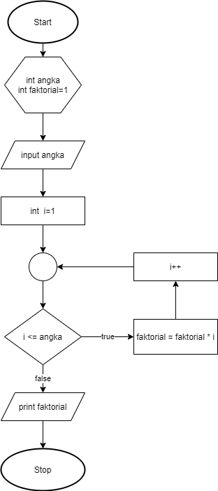
    </p>
    

> Flowchart diatas digunakan untuk menghitung nilai faktorial, selanjutnya kita akan membuat programnya berdasarkan
> flowchart di atas!

2. Tambahkan library Scanner, deklarasi Scanner, dan buat variabel angka untuk menampung data yang diinput melalui keyboard


```Java
// Ketik kode program di bawah sini
import java.util.Scanner;
int angka, faktorial = 1;
Scanner s = new Scanner(System.in);


```


```Java
3. Buatlah deklarasi dan inisialisasi variabel faktorial sesuai dengan flowchart diatas
```


```Java
// Ketik kode program di bawah sini
System.out.print("Input angka: ");
angka = s.nextInt();
for(int i = 1; i<= angka; i++ ){
    faktorial = faktorial *= i;
    System.out.printf("i = %d hasilnya adalah %d\n",i, faktorial,angka);
}
System.out.println("Hasilnya adalah " +faktorial);

```

    Input angka: 10
    i = 1 hasilnya adalah 1
    i = 2 hasilnya adalah 2
    i = 3 hasilnya adalah 6
    i = 4 hasilnya adalah 24
    i = 5 hasilnya adalah 120
    i = 6 hasilnya adalah 720
    i = 7 hasilnya adalah 5040
    i = 8 hasilnya adalah 40320
    i = 9 hasilnya adalah 362880
    i = 10 hasilnya adalah 3628800
    Hasilnya adalah 3628800


4. Tambahkan struktur perulangan untuk menghitung hasil faktorial sebuah nilai yang diinputkan menggunakan for
    
    <p align="left">
    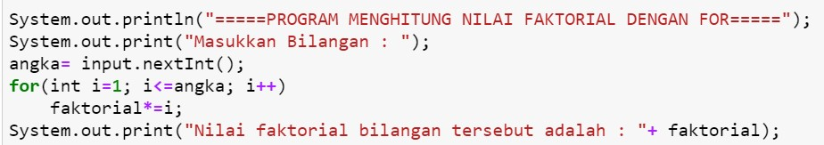
    </p>


```Java
// Ketik kode program di atas di bawah sini
System.out.println("=====PROGRAM MENGHITUNG NILAI FAKTORIAL DENGAN FOR=====");
System.out.print("Masukkan Bilangan : ");
angka = s.nextInt();
for(int i=1; i<=angka; i++)
    faktorial*=i;
System.out.print("Nilai faktorial bilangan tersebut adalah: "+ faktorial);


```

    =====PROGRAM MENGHITUNG NILAI FAKTORIAL DENGAN FOR=====
    Masukkan Bilangan : 10
    Nilai faktorial bilangan tersebut adalah: 7257600

5. Ubah nilai variabel faktorial seperti semula. Kemudian gunakan struktur perulangan while untuk menghitung hasil faktorial sebuah nilai yang diinputkan
    
    <p align="left">
    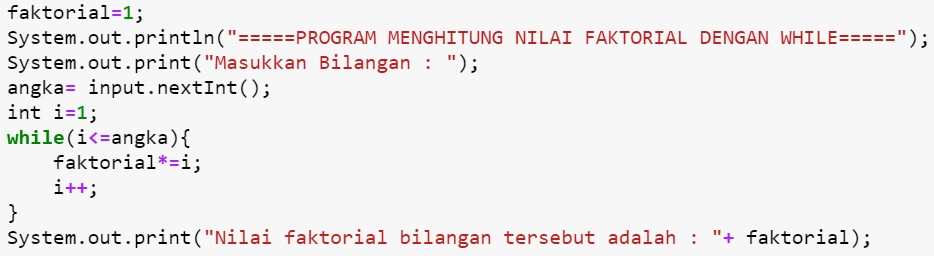
    </p>


```Java
// Ketik kode program di atas di bawah sini
System.out.println("=====PROGRAM MENGHITUNG NILAI FAKTORIAL DENGAN FOR=====");
System.out.print("Masukkan Bilangan : ");
angka = s.nextInt();
for(int i=1; i<=angka; i++)
    faktorial*=i;
System.out.print("Nilai faktorial bilangan tersebut adalah: "+ faktorial);

```

    =====PROGRAM MENGHITUNG NILAI FAKTORIAL DENGAN FOR=====
    Masukkan Bilangan : 10
    Nilai faktorial bilangan tersebut adalah: 3628800

6. Kembalikan lagi nilai variabel faktorial seperti semula. Gunakan struktur perulangan do-while untuk menghitung hasil faktorial sebuah nilai yang diinputkan
    
    <p align="left">
    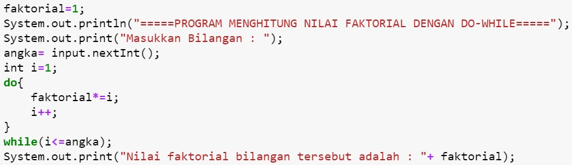
    </p>


```Java
// Ketik kode program di atas di bawah sini
faktorial=1;
System.out.println("=====PROGRAM MENGHITUNG NILAI FAKTORIAL DENGAN DO-WHILE=====");
System.out.print("Masukkan Bilangan : ");
angka = s.nextInt();
int i=1;
do{
    faktorial*=i;
    i++;
}
while(i<=angka);
System.out.print("Nilai faktorial bilangan tersebut adalah: "+ faktorial);


```

    =====PROGRAM MENGHITUNG NILAI FAKTORIAL DENGAN DO-WHILE=====
    Masukkan Bilangan : 10
    Nilai faktorial bilangan tersebut adalah: 3628800

##### Pertanyaan
1. Pada program diatas, apakah kegunaan baris berikut?
<p align="left">
    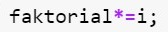
    </p>

#### JAWABAN

1. kegunaan kode "faktorial*=1;" adalah untuk menambahkan variabel sesuai dengan penggunaan operator tersebut. 


2. Modifikasi program diatas dibagian struktur pemilihannya sehingga hasilnya menjadi seperti di bawah ini:
<p align="left">
    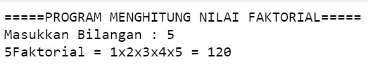
    </p>


```Java
// Ketik kode program di atas di bawah sini
faktorial=1;
System.out.println("=====PROGRAM MENGHIUNG NILAI FAKTORIAL");
System.out.print("Masukkan Bilangan : ");
angka = s.nextInt();

System.out.print(angka + "Faktorial = ");
for(int i=1; i<=angka; i++){
    faktorial*=i;
    System.out.printf(i + "x");
}
System.out.printf(" = "+faktorial);


```

    =====PROGRAM MENGHIUNG NILAI FAKTORIAL
    Masukkan Bilangan : 10
    10Faktorial = 1x2x3x4x5x6x7x8x9x10x = 3628800


    java.io.PrintStream@7fd6f4da


#### Percobaan 2 : Keluar dari perulangan menggunakan break

#### Waktu percobaan : 40 menit

1. Buatlah perulangan dengan menggunakan for yang memanfaatkan keyword break
<p align="left">
    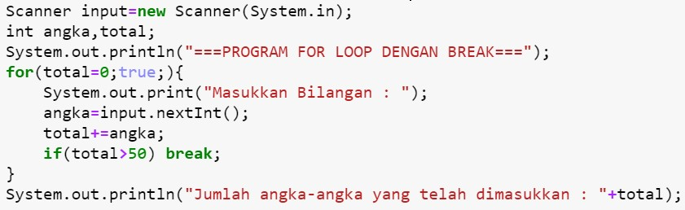
    </p>


```Java
// Ketik kode program di atas di bawah sini
Scanner input= new Scanner(System.in);
int angka,total;
System.out.println("===PROGRAM FOR LOOP DENGAN BREAK===");
for(total=0;true;){
    System.out.print("Masukkan Bilangan : ");
    angka=input.nextInt();
    total+=angka;
    if(total>50) break;
}
System.out.println("Jumlah angka-angka yang telah dimasukkan : "+total);


```

    ===PROGRAM FOR LOOP DENGAN BREAK===
    Masukkan Bilangan : 5
    Masukkan Bilangan : 90
    Jumlah angka-angka yang telah dimasukkan : 95


2. Buat perulangan yang sama dengan struktur perulangan while
<p align="left">
    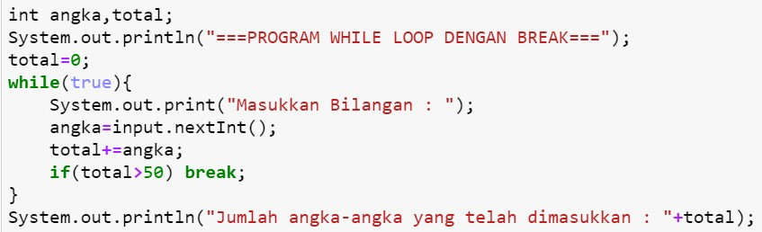
    </p>


```Java
// Ketik kode program di atas di bawah sini
int angka,total;
System.out.println("===PROGRAM WHILE LOOP DENGAN BREAK===");
total=0;
    while(true){
        System.out.print("Masukkan Bilangan : ");
        angka=input.nextInt();
        total+=angka;
        if(total>50) break;
    }
System.out.println("Jumlah angka-angka yang telah dimasukkan : " +total);


```

    ===PROGRAM WHILE LOOP DENGAN BREAK===
    Masukkan Bilangan : 7
    Masukkan Bilangan : 90
    Jumlah angka-angka yang telah dimasukkan : 97


3. Tuliskan perulangan diatas dalam struktur do-while
    <p align="left">
    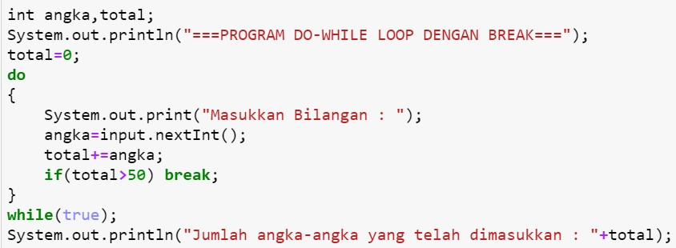
    </p>


```Java
// Ketik kode program di atas di bawah sini
int angka,total;
System.out.println("===PROGRAM DO-WHILE LOOP DENGAN BREAK===");
total=0;
 System.out.print("Masukkan Bilangan : ");
    angka=s.nextInt();
do
{
    
    total+=angka;
    if(total>50) break;
}
while(true);
System.out.println("Jumlah angka-angka yang telah dimasukkan :"+total);


```

    ===PROGRAM DO-WHILE LOOP DENGAN BREAK===
    Masukkan Bilangan : 30
    Jumlah angka-angka yang telah dimasukkan :60


##### Pertanyaan
1. Jelaskan fungsi kode program yang telah dibuat pada percobaan diatas!

#### JAWABAN
1.Program diatas berfungi untuk memberikan output bilangan yang sudah dimasukkan oleh pengguna dengan aturan kode perulangan, dengan begitu output program akan muncul sebagai hasil dari totaal penjumlahan beberapa angka yanng telah dimasukkan dengan angka terakhir lebih dari 50. 


2. Jelaskan fungsi kode berikut!
    <p align="left">
    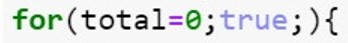
    </p>


#### JAWABAN
2.Jadi disini fungsi kode tersebut untuk memberikan pertambahan nilai pada hasil output/total sesuai dengan masukkan jumlah angka. 


#### Percobaan 3 : Keluar dari step perulangan menggunakan continue

#### Waktu percobaan : 40 menit

1. Buat program looping menggunakan struktur perulangan for seperti di bawah ini: 
<p align="left">
    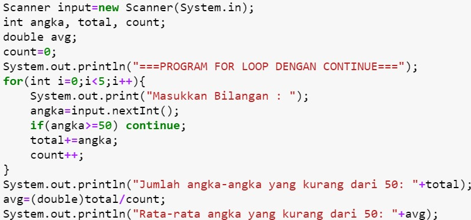
    </p>


```Java
// Ketik kode program di atas di bawah sini
Scanner input=new Scanner(System.in);
int angka, total, count;
double avg;
count=0;
System.out.println("===PROGRAM FOR LOOP DENGAN CONTINUE");
for(int i=0;i<5;i++){
    System.out.print("Masukkan Bilangan : ");
    angka=input.nextInt();
    if(angka>=50) continue;
    total+=angka;
    count++;
}
System.out.println("Jumlah angka-angka yang kurang dari 50: "+total);
avg=(double)total/count;
System.out.println("Rata-rata angka yang kurang dari 50: "+avg);


```

    ===PROGRAM FOR LOOP DENGAN CONTINUE
    Masukkan Bilangan : 10
    Masukkan Bilangan : 10
    Masukkan Bilangan : 10
    Masukkan Bilangan : 70
    Masukkan Bilangan : 80
    Jumlah angka-angka yang kurang dari 50: 30
    Rata-rata angka yang kurang dari 50: 10.0


```Java
5. Jalankan program. Amati apa yang terjadi!
```

##### Pertanyaan
1. Jelaskan Perbedaan dari percobaan 2 dan percobaan 3

#### JAWABAN
1. Perbedaan dari percobaan 2 & 3 yaitu, dalam percobaan 2 menggunakan "break" yang berfungsi  untuk ‘menghentikan paksa’ proses perulangan yang berlangsung, lalu dalam percobaan 3 menggunakan "continue",perintah continue hanya akan menghentikan perulangan sesuai masukkan, dan kemudian melanjutkan perulangan berikutnya, atau bisa disebut juga untuk ‘melewati’ 1 perulangan.


2. Jelaskan apa fungsi perintah kode program dibawah ini?
<p align="left">
    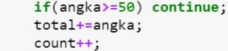
    </p>

#### JAWABAN
Fungsi perintah kode program diatas adalah bila program dijalankan,maka angka yang diinput lebih dari 50 akan terlewati/tidak dibaca, selanjutnya program akan menjumlah angka dan menghitung angka sesuai dengan input an kode diatas.


### Tugas

#### Waktu pengerjaan Tugas: 140 menit

1. Buatlah program yang meminta masukan user sebuah bilangan bulat N (N > 0). Program kemudian menampilkan penjumlahan N bilangan genap positif pertama (bilangan genap ≥ 0).
Contoh: 
    •	Jika user memasukkan N = 10, program akan menghitung banyaknya jumlah bilangan positive di dalam range bilangan 1-10   kemudian menampilkan penjumlahan bilangan positive bilangan bilangan diantara 1-10 yaitu : 
        0 + 2 + 4 + 6 + 10 = 30. 
        Setelah itu program akan menampilkan rata-rata dari bilangan positive yang telah dijumlahkan tadi.
    •	Contoh output program dan flowchart
<br/>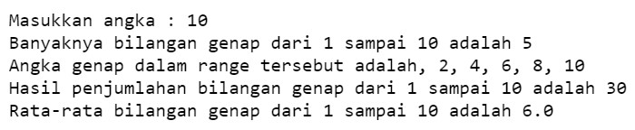<br/>
  

<br/>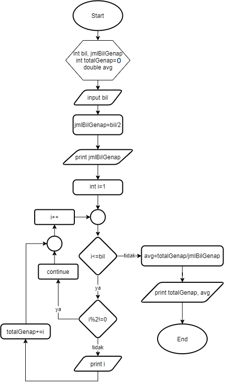


```Java
// Ketik kode program disini
int bil, jmlBilGenap, totalGenap = 1;
double avg;

System.out.print("Masukkan angka: ");
bil = s.nextInt();
jmlBilGenap = bil / 2;

System.out.printf("Banyaknya bilangan genap dari 1 sampai %d adalah %d\n",bil,jmlBilGenap);
System.out.print("Angka genap dalam range tersebut adalah");
for(int i=1;i<=bil;i++)
{
    if(i%2!=0)continue;
    System.out.printf(", %d",i);
    totalGenap += i;
}
avg = (double)(totalGenap-1) / jmlBilGenap;
System.out.printf("\nHasil penjumlahan bilangan genap dari 1 sampai %d adalah %d",bil,totalGenap-1);
System.out.printf("\nRata-rata bilangan genap dari 1 sampai %d adalah %.1f",bil,avg);
```

    Masukkan angka: 10
    Banyaknya bilangan genap dari 1 sampai 10 adalah 5
    Angka genap dalam range tersebut adalah, 2, 4, 6, 8, 10
    Hasil penjumlahan bilangan genap dari 1 sampai 10 adalah 30
    Rata-rata bilangan genap dari 1 sampai 10 adalah 6.0


    java.io.PrintStream@7fd6f4da


#### Penjelasan Kode Program
Kode program diatas berfungsi untuk memberikan output data "Banyaknya bilangan genap dari sesuai angka inputan,
Angka genap dalam range angka yang diinput user,
Hasil penjumlahan bilangan genap dari angka yang diinput,
Rata-rata bilangan genap dari angka yang diinput oleh user juga.

2. Buatlah program untuk menampilkan angka 1 hingga angka masukan pengguna secara berurutan dan melompati angka kelipatan 5. Seperti tampilan di bawah ini
<p align="left">
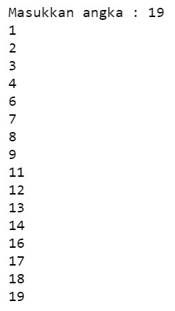
</p>


```Java
// Ketik kode program disini
Scanner in=new Scanner(System.in);

int x, angka;

System.out.print("Masukkan angka : ");
angka = in.nextInt();

for(x=1; x<=angka; x++) {
    if (x%5==0) continue;
    System.out.println(x);
}
```

    Masukkan angka : 19
    1
    2
    3
    4
    6
    7
    8
    9
    11
    12
    13
    14
    16
    17
    18
    19


#### Penjelasan Kode Program
Kode program diatas akan memberikan output perulangan dari nomor 1 sampai nomor 19 tetapi dengan melewati nomor 10.

3. Buatlah sebuah program yang menampilkan deret bilangan fibonacci sebagai berikut. Dimana bilangan yang terletak di sebelah kanan adalah hasil penjumlahan dari 2 bilangan sebelumnya
 <p align="left">
    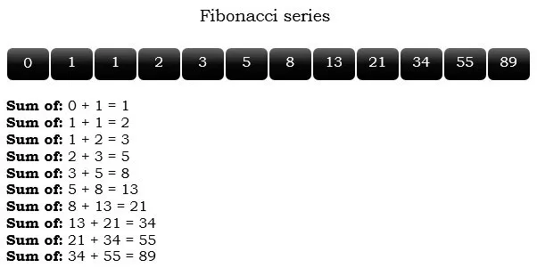
    </p>


```Java
// Ketik kode program disini
import java.util.Scanner;
        int limit, past, current, fibonacci;
        Scanner input = new Scanner(System.in);
        System.out.print("Masukan banyak bilangan yang mau ditampilkan: ");
        limit = input.nextInt();
        past = 0;
        current = 1;
        fibonacci = 1;
        for (int i =1; i <= limit; i++){
            System.out.printf("sum of: %d + %d = %d\n",past,current,fibonacci);
            fibonacci = past + current;
            past = current;
            current = fibonacci;
        }
```

    Masukan banyak bilangan yang mau ditampilkan: 10
    sum of: 0 + 1 = 1
    sum of: 1 + 1 = 1
    sum of: 1 + 2 = 2
    sum of: 2 + 3 = 3
    sum of: 3 + 5 = 5
    sum of: 5 + 8 = 8
    sum of: 8 + 13 = 13
    sum of: 13 + 21 = 21
    sum of: 21 + 34 = 34
    sum of: 34 + 55 = 55


#### PENJELASAN KODE

kode diatas berfungsi untuk memberikan output hasil proses penjumlahan sejumlah angka yang diinput oleh user.
